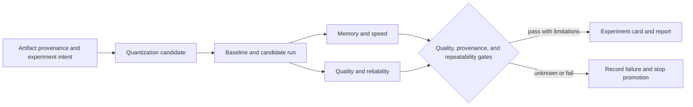

```mermaid
flowchart LR
    P["Artifact provenance and experiment intent"] --> Q["Quantization candidate"]
    Q --> B["Baseline and candidate run"]
    B --> M["Memory and speed"]
    B --> E["Quality and reliability"]
    M --> G{"Quality, provenance, and repeatability gates"}
    E --> G
    G -->|pass with limitations| C["Experiment card and report"]
    G -->|unknown or fail| U["Record failure and stop promotion"]
```
