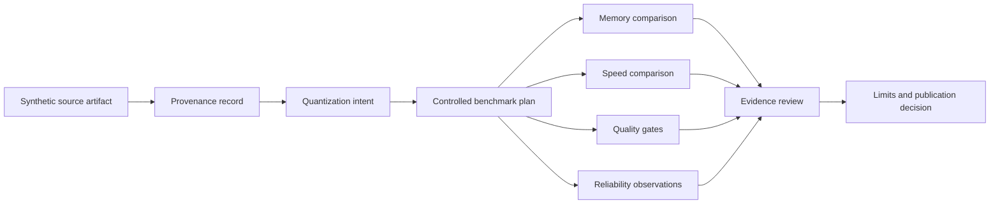

```mermaid
flowchart LR
  S["Synthetic source artifact"] --> P["Provenance record"]
  P --> Q["Quantization intent"]
  Q --> B["Controlled benchmark plan"]
  B --> M["Memory comparison"]
  B --> T["Speed comparison"]
  B --> U["Quality gates"]
  B --> R["Reliability observations"]
  M --> E["Evidence review"]
  T --> E
  U --> E
  R --> E
  E --> L["Limits and publication decision"]
```
