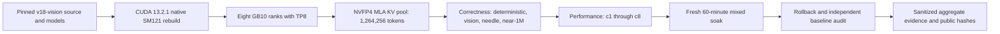

```mermaid
flowchart LR
    S["Pinned v18-vision source and models"] --> B["CUDA 13.2.1 native SM121 rebuild"]
    B --> C["Eight GB10 ranks with TP8"]
    C --> K["NVFP4 MLA KV pool: 1,264,256 tokens"]
    K --> V["Correctness: deterministic, vision, needle, near-1M"]
    V --> P["Performance: c1 through c8"]
    P --> T["Fresh 60-minute mixed soak"]
    T --> R["Rollback and independent baseline audit"]
    R --> E["Sanitized aggregate evidence and public hashes"]
```
